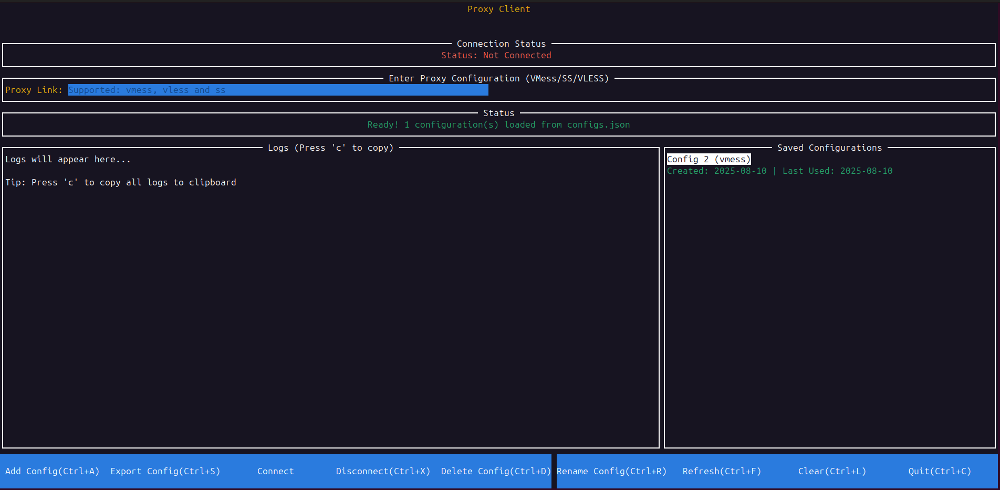

# V2Ray Client Configuration Generator



A terminal-based user interface (TUI) application for managing V2Ray and sing-box configurations.

## Features

- Parse and validate multiple proxy protocols:
  - **VMess** (`vmess://`) - Advanced proxy protocol with multiple transport options
  - **Shadowsocks** (`ss://`) - Fast and lightweight proxy protocol
  - **VLESS** (`vless://`) - Lightweight proxy protocol with TLS support
- Save and manage multiple configurations
- Connect using V2Ray or sing-box clients
- Export configurations to JSON files
- File browser for export operations
- Real-time connection status monitoring
- Automatic process cleanup on disconnect

## Architecture

The application has been refactored into a modular structure for better maintainability:

### Core Modules

- **`tui/types.go`** - Data structures and type definitions
- **`tui/tui.go`** - Main TUI initialization and lifecycle management
- **`tui/ui_setup.go`** - UI component creation and layout management
- **`tui/keybindings.go`** - Keyboard shortcuts and input handling
- **`tui/config_management.go`** - Configuration CRUD operations
- **`tui/connection_management.go`** - V2Ray and sing-box connection handling
- **`tui/disconnect_management.go`** - Process cleanup and disconnection logic
- **`tui/file_operations.go`** - File export and directory browsing
- **`tui/ui_utils.go`** - Utility functions for UI updates and clipboard handling
- **`tui/vmess_parser.go`** - VMess link parsing and configuration conversion

### Key Benefits of the Modular Structure

1. **Separation of Concerns** - Each module handles a specific aspect of the application
2. **Maintainability** - Easier to locate and modify specific functionality
3. **Testability** - Individual modules can be tested in isolation
4. **Reusability** - Components can be reused across different parts of the application
5. **Readability** - Code is organized logically and easier to understand

## Usage

### Keyboard Shortcuts

- `Ctrl+A` - Add new configuration
- `Ctrl+S` - Export configuration
- `Ctrl+D` - Delete selected configuration
- `Ctrl+R` - Rename selected configuration
- `Ctrl+F` - Refresh configurations
- `Ctrl+L` - Clear UI
- `Ctrl+X` - Disconnect
- `Ctrl+C` - Quit application
- `Ctrl+V` - Paste from clipboard (in VMess input field)
- `Enter` - Parse VMess link (in VMess input field)

### Basic Workflow

1. **Add Configuration**: Paste a proxy link (VMess/SS/VLESS) and press `Ctrl+A`
2. **View Configuration**: Select a configuration from the list to view details
3. **Connect**: Select a configuration and click "Connect" to choose between V2Ray or sing-box
4. **Export**: Use `Ctrl+S` to export configurations to JSON files
5. **Disconnect**: Use `Ctrl+X` to safely disconnect and clean up processes

## Dependencies

- `github.com/gdamore/tcell/v2` - Terminal UI framework
- `github.com/rivo/tview` - Rich terminal UI components

## Building

```bash
go build -o go_v2ray_client .
```

## Running

```bash
./go_v2ray_client
```

## Requirements

- Go 1.24.4 or later
- V2Ray or sing-box client installed (for connection functionality)
- Linux/macOS for clipboard paste functionality

## Configuration Storage

Configurations are stored in `configs.json` in the application directory. The file structure includes:

- Configuration details (ID, name, protocol, link, timestamps)
- Metadata (version, total count, last updated)

## Supported Protocols

The application supports three main proxy protocols:

### VMess (`vmess://`)
- Advanced proxy protocol with multiple transport options
- Supports WebSocket, HTTP/2, TCP, and other transport methods
- Built-in TLS support with fingerprint spoofing

### Shadowsocks (`ss://`)
- Fast and lightweight proxy protocol
- Multiple encryption methods (AES-256-GCM, ChaCha20-Poly1305, etc.)
- Simple and efficient for most use cases

### VLESS (`vless://`)
- Lightweight proxy protocol with minimal overhead
- Built-in TLS support
- Multiple transport options (WebSocket, gRPC, HTTP/2, etc.)

## Connection Management

The application automatically manages:
- Port 1080 usage monitoring
- Process lifecycle management
- Safe disconnection with multiple fallback methods
- Real-time status updates

## Error Handling

- Comprehensive error messages for user feedback
- Graceful fallbacks for failed operations
- Manual cleanup instructions when automatic methods fail 